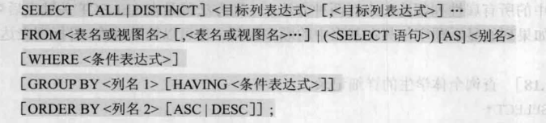

记录一些关系型数据库中常用的sql语句。

特点：大小写不敏感、结尾带分号。

## DDL数据定义语言

操作数据库

```sql
show databases;		# 展示数据库
select database();	# 查询当前使用的数据库
create database [if not exist] database_name [default charset xxx];	# 创建数据库
use database_name;	# 指定使用数据库
drop database [if exists] database_name;	# 删除数据库
```

操作表

```sql
create table  表名(
        字段1  字段1类型 [约束]  [comment  字段1注释 ],
        字段2  字段2类型 [约束]  [comment  字段2注释 ],
        ......
        字段n  字段n类型 [约束]  [comment  字段n注释 ] 
) [ comment  表注释 ] ;

-- 创建表时指定
create table 表名(
        字段名    数据类型,
        ...
        [constraint]   [外键名称]  foreign  key (外键字段名)   references   主表 (主表列名)  
);

-- 建完表后，添加外键
alter table  表名  add constraint  外键名称  foreign key(外键字段名) references 主表(主表列名);

show tables;		# 查看表
desc 表名;		# 查看表的信息
show create table 表名;	# 查看建表语句

alter table 表名 add  字段名  类型(长度)  [comment 注释]  [约束];
alter table 表名 modify  字段名  新数据类型(长度);
alter table 表名 change  旧字段名  新字段名  类型(长度)  [comment 注释]  [约束];

alter table 表名 drop 字段名;
rename table 表名 to  新表名;
drop  table [ if exists ]  表名;
```

约束：

- 非空约束：``not null``
- 唯一约束：``unique``
- 主键约束：``primary key``
- 默认约束：``default``，如果没有指定值则使用默认值

## DML数据操作语言

对表中数据进行增、删、改。

```sql
insert into 表名 (字段名1, 字段名2) values (值1, 值2);
insert into 表名 values (值1, 值2, ...);
insert into 表名 (字段名1, 字段名2) values (值1, 值2), (值1, 值2);
insert into 表名 values (值1, 值2, ...), (值1, 值2, ...);

update 表名 set 字段名1 = 值1 , 字段名2 = 值2 , .... [where 条件] ;

delete from 表名  [where  条件] ;
```

## DQL数据查询语言

### 基本查询



注：

- having用于分组之后的聚合、判断
- limit 起始索引,查询记录数 ; 实现分页查询

### 多表查询

#### 连接查询

**内连接**（相当于查询两个表的交集）

隐式内连接：

```sql
select * from t1, t2 where t1.id = 连接条件;
```

显式内连接：

```sql
select * from t1 inner join t2 on 连接条件;
```

**外连接**

左外连接，查询左表的所有数据 + 两个表的交集数据。

```sql
select * from t1 left [outer] join t2 on 连接条件;
```

右外连接类似。

```sql
select * from t1 right [outer] join t2 on 连接条件;
```

#### 子查询
