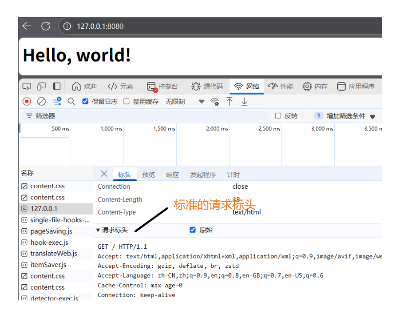

Servlet是用于Web开发的工具，简而言之Web开发就是需要编写在服务器上运行的代码，可以接受浏览器请求、响应返回数据，也就是典型的B/S架构。（下述内容参考[廖雪峰老师的Java教程](https://liaoxuefeng.com/books/java/web/index.html)）

### Web开发入门案例

首先来看一下使用网络编程中学到的内容来编写一个程序，使得服务器在收到浏览器请求时可以自动解析请求并返回对应的结果。需要一个ServerSocket来监听指定的接口、如果收到请求就响应得到一个Socket对象，通过这个Socket对象可以获得输入流、输出流，从而实现请求的解析和响应，考虑到多线程访问服务器，因此这里通过线程对象来实现网络流的处理。那么这部分的代码可以写作：

```Java
public class Server {
    public static void main(String[] args) throws IOException {
        ServerSocket ss = new ServerSocket(8080);	// 监听8080接口
        System.out.println("server is running");
        for(;;) {
            Socket sock = ss.accept();			// 收到请求就返回Socket对象
            System.out.println("connected from " + sock.getInetAddress());
            Thread t = new Handler(sock);		// 线程对象来解析、响应请求
            t.start();
        }
    }
}
```

接下来是线程对象的实现，线程对象会接受一个Socket对象，通过获得输入流实现请求的解析，通过输出流来实现返回响应，整体的思路很简单，需要注意解析时要根据**请求标头**来判断是否合法。

那么如果我们向服务器发送一个请求，典型的请求标头见下：



这里把GET请求当做标准的请求标头，因此判断请求是否合理时只要判断接受到的数据是否以这个标准开始即可。所以代码可以写作：

```java
class Handler extends Thread {
    Socket sock;
    public Handler(Socket sock) {
        this.sock = sock;
    }
    public void run() {
        try {
            // 获得网络流
            var reader = new BufferedReader(new InputStreamReader(sock.getInputStream()));
            var writer = new BufferedWriter(new OutputStreamWriter(sock.getOutputStream()));
            boolean requestOk = false;
            String first = reader.readLine();
            // 判断请求是否合法
            if(first.startsWith("GET / HTTP/1.")){
                requestOk = true;
            }
            // 逐行打印出请求行的信息
            for(;;){
                String header = reader.readLine();
                if(header.isEmpty()){
                    break;
                }
                System.out.println(header);
            }
            System.out.println(requestOk? "response ok" :"response error");
            // 如果非法请求，向网络流写入404响应行
            if(!requestOk){
                writer.write("HTTP/1.0 404 Not Found");
                writer.write("Content-Length: 0\r\n");
                writer.write("\r\n");
                writer.flush();
            }else{
                // 合法请求向网络写入成功响应的信息，其中包含markdown文本
                String data = "<html><body><h1>Hello, world!</h1></body></html>";
                int length = data.getBytes(StandardCharsets.UTF_8).length;
                writer.write("HTTP/1.0 200 OK\r\n");
                writer.write("Connection: close\r\n");
                writer.write("Content-Type: text/html\r\n");
                writer.write("Content-Length: " + length + "\r\n");
                writer.write("\r\n"); // 空行标识Header和Body的分隔
                writer.write(data);
                writer.flush();
            }
        } catch (IOException e) {
            throw new RuntimeException(e);
        }
    }
}
```

以上是简单的服务器响应浏览器请求的例子，其中的逻辑比较简单，但是需要手动解析网络流、写入网络流的响应数据，而实际业务中的标头有非常多的类型，并且应当根据多种不同的状态响应不同的数据，所以需要Servlet这样的工具（或者理解为容器）来简化web开发。

### Servlet案例（依赖tomcat容器）

接下来是对上面代码的简化，在配置好maven依赖之后可以直接编写继承自HttpServlet的对象，重写响应GET请求的方法，在Servlet容器中底层会自动传入对应的请求对象和响应对象（和上面的实现类似）。

首行注解代表网页的根目录"/"会交给下面的HttpServlet对象来处理。

```java
@WebServlet(urlPatterns = "/")
public class HelloServlet extends HttpServlet {
    protected void doGet(HttpServletRequest req, HttpServletResponse resp)
            throws ServletException, IOException {
        // req.getParameter()
        // 设置响应类型:
        resp.setContentType("text/html");
        // 获取输出流:
        PrintWriter pw = resp.getWriter();
        // 写入响应:
        pw.write("<h1>Hello, world!</h1>");
        // 最后不要忘记flush强制输出:
        pw.flush();
    }
}
```

通过maven进行打包，将打包好的war文件放在tomcat的webapp目录下，即可通过tomcat来运行程序（这里依赖tomcat，因此不需要编写main函数即可实现），这样的话就大大简化的web开发。但是这种方式需要打包并交给tomcat处理，不便于代码调试和运行，因此接下来考虑在IDE中启动tomcat服务器，通过创建tomcat对象来让Web开发仅依靠IDE。

### IDE中使用tomcat和Servlet

首先对地址映射进行响应的类HelloServlet不必修改，只需要在maven中引入tomcat依赖、编写Main.java程序入口类即可。

```java
public class Main {
    public static void main(String[] args) throws LifecycleException {
        // 声明一个tomcat对象
        Tomcat tomcat = new Tomcat();
        // 为tomcat对象指定接口
        tomcat.setPort(Integer.getInteger("port", 8080));
        // 连接concat服务器
        tomcat.getConnector();
        // 向tomcat注册一个web应用，并设置web应用的根目录
        Context ctx = tomcat.addWebapp("", new File("src/main/webapp").getAbsolutePath());
        // 为这个web应用声明资源管理器
        WebResourceRoot resources = new StandardRoot(ctx);
        // 这里还没有完全明白？我觉得应该是指定资源的查找路径、class文件的存放地址等？
        resources.addPreResources(
                new DirResourceSet(resources, 
                "/WEB-INF/classes",
                new File("target/classes").getAbsolutePath(),
                "/"));
        ctx.setResources(resources);
        // 启动tomcat服务器
        tomcat.start();
        tomcat.getServer().await();
    }
}
```

接下来运行Main.java文件，访问本机的8080端口即可看到成功响应请求。

### Servlet进阶

#### 重定向

当某些资源被迁移到其他地址之后，希望用户访问旧地址之后，服务器可以识别并且自动映射到对应的新地址，这就需要重定向来实现。下面来看一下使用重定向，将"/hi"这个地址映射到"/hello"。重定向过程中需要构造新的URL（也就相当于指定映射对象，接下来将处理响应的resp重定向到上面的URL中。代码实现为：

```java
@WebServlet(urlPatterns = "/hi")
public class RedirectServlet extends HttpServlet {
    protected void doGet(HttpServletRequest req, HttpServletResponse resp) throws IOException {
        String name = req.getParameter("name");
        String redirectToUrl = "/hello" + (name==null ? "":"?name="+name);
        resp.sendRedirect(redirectToUrl);
    }
}
```

在浏览器中输入 ``localhost:8080/hi``，那么服务器会识别这是旧映射并且返回给浏览器3XX响应（代表重定向）、底层找到新的映射，这个过程中可以看到浏览器相当于发送了两次请求，第一次旧映射返回3XX，第二次新映射返回2XX，表示请求成功。


#### 转发

如果一个映射的处理逻辑和其他已有映射相似，那么可以通过转发操作交付给其他映射对象处理，和重定向不同的是，浏览器中只会看到一次请求，也就是说转发操作是服务器内部进行的、外部不可见。

转发操作需要先找到目标映射对象，并且将请求对象、响应对象都交付给新的目标映射处理。（这里也能看到和重定向的区别，重定向通过响应对象交付URL地址，而转发操作会同时交付请求对象和响应对象）

```java
@WebServlet(urlPatterns = "/morning")
public class ForwardServlet extends HttpServlet {
    protected void doGet(HttpServletRequest req, HttpServletResponse resp) throws ServletException, IOException {
        req.getRequestDispatcher("/hello").forward(req, resp);
    }
}
```

### Session和Cookie

这部分的内容很有意思，先来思考日常生活中常见的场景，登陆某个电商平台后，之后点击任何商品界面下单都不需要重新登陆，这对用户体验来说非常重要，而Http协议是“无状态的”（客户端发送请求、服务器响应，之后立即断开，不会保留历史信息），通过Session会话机制和Cookie就可以实现“记忆”用户信息。（这个Cookie之前也经常见，比如某些网站突然无法访问，那么删除对应的cookie之后就可以重新访问）

从一个简单的场景来看Session机制怎样实现。登陆界面中当用户输入正确的信息，那么浏览器需要“记忆”这个会话的信息（也就是用户，要“记得”这个用户登陆过，那么之后这个用户可以访问网页中的其他资源）。**实现**：通过请求对象得到会话对象(Session)、记录对应的属性(Attribute)信息，属性为键值对形式代码见下，

```Java
@WebServlet(urlPatterns = "/signin")      // 登陆页面
public class SignInServlet extends HttpServlet {
    // 模拟数据库
    private Map<String, String> users = Map.of("bob", "bob123", "alice", "alice123", "tom", "tomcat");
    // 响应Get请求，展示登陆界面
    protected void doGet(HttpServletRequest req, HttpServletResponse resp) throws ServletException, IOException {
        resp.setContentType("text/html");
        PrintWriter pw = resp.getWriter();
        pw.write("<h1>Sign In</h1>");
        pw.write("<form action=\"/signin\" method=\"post\">");  // 这里指定了表单提交使用post请求
        pw.write("<p>Username: <input name=\"username\"></p>");
        pw.write("<p>Password: <input name=\"password\" type=\"password\"></p>");
        pw.write("<p><button type=\"submit\">Sign In</button> <a href=\"/\">Cancel</a></p>");
        pw.write("</form>");
        pw.flush();
    }
    // 响应Post请求
    protected void doPost(HttpServletRequest req, HttpServletResponse resp) throws IOException {
        String name = req.getParameter("username");
        String password = req.getParameter("password");
        String expectedPassword = users.get(name.toLowerCase());
        if(expectedPassword!=null && expectedPassword.equals(password)){
            // 成功登陆之后，得到会话对象并且设置属性来记忆
            req.getSession().setAttribute("user", name);
            resp.sendRedirect("/");
        } else {
            resp.sendError(HttpServletResponse.SC_FORBIDDEN);
        }
    }
}
```

那么在主界面"/"中就可以判断当前会话是否登陆过，也是通过请求对象得到会话对象，通过得到属性键为"user"的值，来判断登陆信息。同样地，可以设计登出页面("/logout")，只需要清空属性中的记录即可。

```Java
@WebServlet(urlPatterns = "/")
public class IndexServlet extends HttpServlet {
    protected void doGet(HttpServletRequest req, HttpServletResponse resp) throws IOException {
        String user = (String) req.getSession().getAttribute("user");
        resp.setContentType("text/html");
        resp.setCharacterEncoding("UTF-8");
        resp.setHeader("X-Powered-By", "JavaEE Servlet");
        PrintWriter pw = resp.getWriter();
        pw.write("<h1>Welcome, " + (user != null ? user : "Guest") + "</h1>");
        if (user == null) {
            // 未登录，显示登录链接:
            pw.write("<p><a href=\"/signin\">Sign In</a></p>");
        } else {
            // 已登录，显示登出链接:
            pw.write("<p><a href=\"/signout\">Sign Out</a></p>");
        }
        pw.flush();
    }
}
```
